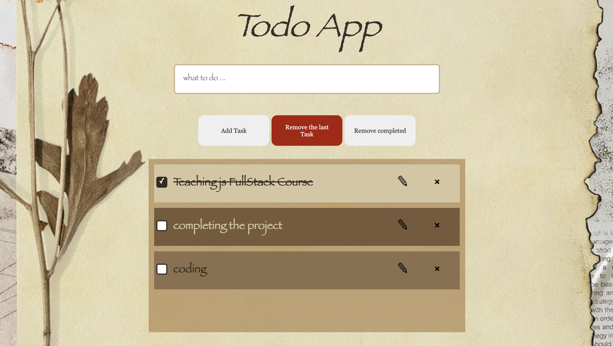

# VanillaJS TodoApp

This project is a teaching resource for a full-stack course, showcasing the implementation of CRUD (Create, Read, Update, Delete) operations for a todo application. It utilizes JavaScript, HTML, and CSS to provide a functional and interactive user interface.

## Technologies Used:

- **JavaScript:** Used to implement the functionality of the todo application.
- **HTML:** Responsible for structuring the project and creating the necessary elements.
- **CSS:** Used for styling the application and enhancing the visual appeal.
- **localStorage** : for saving the tasks

## screenShot:

## Usage:

- Fork the repository.
- Clone the repository to your local machine.
- Build the project step by step instead of simply copying and pasting the code.
- Familiarize yourself with the codebase, understand the different components, and how they interact.
- Modify and customize the code as needed, experimenting with different features and functionalities.

## Note:

- Please note that this project was specifically developed for educational purposes during my tenure as the Head of Education at Social Hackers Academy. It was designed to facilitate teaching and learning experiences, providing practical examples and exercises for students in various programming and web development courses. The project aims to enhance students' understanding of JavaScript, HTML, and CSS concepts, as well as their ability to implement CRUD operations and build interactive applications.
